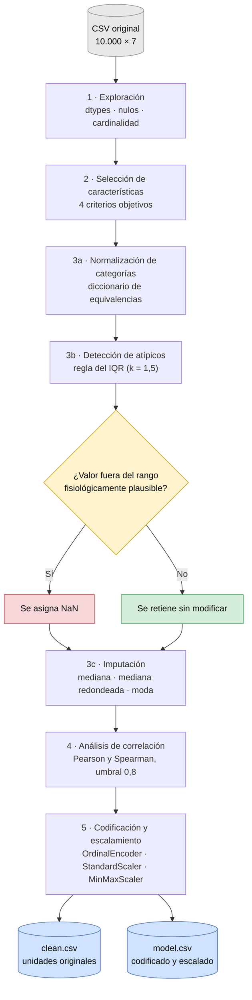
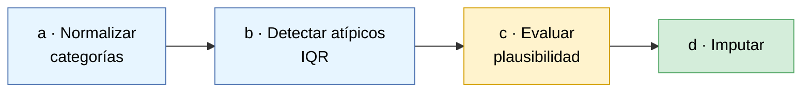
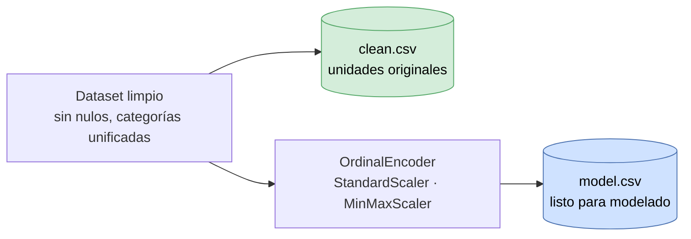

<div align="center">

# Limpieza y procesamiento de datos biométricos de un smartwatch

**Unidad 1 · Machine Learning · DUOC UC**


Preparación de un conjunto de 10.000 registros biométricos con tipos mal inferidos,
categorías inconsistentes, valores faltantes y valores fisiológicamente imposibles,
hasta dejarlo en condiciones de alimentar un modelo.

</div>

---

## Resumen del resultado

<div align="center">

| Indicador | Original | Procesado |
|---|:---:|:---:|
| Registros | 10.000 | 10.000 |
| Variables | 7 | 6 |
| Variables con valores faltantes | 7 (1,0 % – 4,0 %) | 0 |
| Etiquetas en `Activity Level` | 6 | 3 |
| Máximo de `Heart Rate (BPM)` | 296,6 | dentro de rango fisiológico |
| Mínimo de `Sleep Duration (hours)` | −0,19 | dentro de rango fisiológico |
| Filas eliminadas | — | 0 |
| Variables winsorizadas o recortadas | — | 0 |

</div>

Desarrollo completo, con código, gráficos y justificaciones:
**[notebooks/01_limpieza_health_data.ipynb](notebooks/01_limpieza_health_data.ipynb)**

---

## Pipeline



---

## Conjunto de datos

Cada fila corresponde a una medición registrada por el dispositivo.

| Variable | Tipo | Rol | Decisión |
|---|---|---|:---:|
| `User ID` | Entero | Identificador administrativo | Descartada |
| `Heart Rate (BPM)` | Continua | Indicador fisiológico central (CV 0,26) | Retenida |
| `Blood Oxygen Level (%)` | Continua | Saturación de oxígeno, rango estrecho (CV 0,02) | Retenida |
| `Step Count` | Continua | Actividad física, mayor dispersión del conjunto (CV 0,99) | Retenida |
| `Sleep Duration (hours)` | Continua | Duración del descanso | Retenida |
| `Activity Level` | Categórica ordinal | Único campo de texto del dataset | Retenida |
| `Stress Level` | Ordinal entera (1–10) | Indicador de bienestar | Retenida |

### Problemas de calidad detectados

| Problema | Evidencia cuantificada | Consecuencia si no se trata |
|---|---|---|
| Tipos mal inferidos | `Sleep Duration (hours)` y `Stress Level` se leen como `object`: contienen 247 literales `"ERROR"` y 49 `"Very High"` | Ninguna operación aritmética ni estadístico es calculable sobre esas columnas |
| Categorías inconsistentes | `Activity Level` presenta 6 etiquetas para 3 niveles reales (`Actve`, `Seddentary`, `Highly_Active`) | La moda se calcula sobre categorías fragmentadas y la codificación genera niveles espurios |
| Valores faltantes | Entre 1,0 % y 4,0 % por columna, presentes en las 7 variables | La eliminación por lista (*listwise deletion*) descartaría ~15 % de los registros |
| Valores implausibles | 50 pulsos > 200 bpm (máx. 296,6), 84 pulsos exactamente iguales a 40,0 y 1 duración de sueño negativa | Desplazan media, desviación estándar y, por arrastre, los parámetros del escalador |

---

## Desarrollo

<details open>
<summary><b>1 · Exploración inicial</b></summary>

<br>

Se construye una tabla de diagnóstico por columna con `dtypes`, `notna().sum()`,
`isna().mean()` y `nunique()`, complementada con `describe()` para las numéricas y
`describe(include="str")` para las de texto.

Adicionalmente se listan los valores únicos de cada columna no numérica, separando los
que no son convertibles a número. Es este paso el que revela que las dos columnas
mal tipificadas no son categóricas, sino numéricas contaminadas con literales de error.

**Por qué antes de cualquier transformación:** el diagnóstico define qué tratamiento
corresponde a cada columna. Aplicar una limpieza estándar sin este paso trataría
`Sleep Duration (hours)` como variable de texto.

</details>

<details open>
<summary><b>2 · Selección de características</b></summary>

<br>

La decisión no se toma por intuición. Se evalúan cuatro criterios sobre todas las
columnas en igualdad de condiciones:

| Criterio | Métrica | Regla de descarte |
|---|---|---|
| Rol semántico | Qué representa la variable en el fenómeno estudiado | Se descartan identificadores administrativos |
| Cardinalidad | `nunique() / len(df) · 100` | Cardinalidad cercana al 100 % en una variable no continua indica un identificador |
| Variabilidad | Coeficiente de variación, `std / mean` | Varianza nula o casi nula: no discrimina entre registros |
| Completitud | `isna().mean() · 100` | Sobre 40 % de nulos la imputación deja de ser confiable |

**Conversión previa.** Para que la variabilidad sea calculable, las columnas mal
tipificadas se convierten con `pd.to_numeric(errors="coerce")`, que transforma los
literales no válidos en `NaN`. La conversión no resuelve el problema: lo **reexpresa**
como valor faltante para que el apartado de imputación lo trate con un criterio
explícito, en lugar de eliminarlo silenciosamente.

**Resultado.** Se descarta únicamente `User ID`. Su magnitud numérica no codifica
información biométrica; retenerla induciría al modelo a ajustar relaciones sobre un
número arbitrario. Las seis restantes superan los cuatro criterios: todas presentan
variabilidad no nula y su proporción de nulos (1,0 %–4,0 %) está muy por debajo del
umbral de descarte.

</details>

<details open>
<summary><b>3 · Valores faltantes y atípicos</b></summary>

<br>

El orden de las tres operaciones es deliberado: cada una condiciona los estadísticos de
la siguiente.



### a · Normalización de categorías

Se unifican las seis etiquetas mediante un diccionario de equivalencias aplicado con
`Series.replace()`:

```
Seddentary     ──┐
Sedentary      ──┴──▶  Sedentary
Actve          ──┐
Active         ──┴──▶  Active
Highly_Active  ──┐
Highly Active  ──┴──▶  Highly Active
```

**Por qué va primero:** `Activity Level` se imputa con la moda. Sobre categorías
fragmentadas, la frecuencia de cada nivel real queda repartida entre sus variantes y la
moda puede recaer en la categoría equivocada.

### b · Detección de atípicos: regla del IQR

Se marca como atípico todo valor fuera del intervalo

```
     Q1 − 1,5·IQR            Q1    mediana    Q3            Q3 + 1,5·IQR
  ───────┊────────────────────┣━━━━━━━┃━━━━━━━┫────────────────────┊───────
  atípico┊       normal       ┊               ┊       normal       ┊atípico

                          IQR = Q3 − Q1
```

**Por qué IQR y no z-score:** el z-score asume normalidad y se calcula sobre media y
desviación estándar, ambas sensibles a los propios valores extremos que se quiere
detectar — un outlier suficientemente grande infla σ y termina enmascarándose a sí mismo.
Los cuartiles son estadísticos de orden: no se ven afectados por la magnitud de los
valores extremos.

Cada variable se grafica con histograma y boxplot superpuestos sobre el mismo eje, con
los límites del IQR y la mediana marcados. El objetivo es distinguir un fallo de sensor
de la cola legítima de una distribución asimétrica, lectura que el boxplot por sí solo
no permite.

### c · Criterio de tratamiento: implausibilidad, no lejanía

La regla del IQR es un criterio **estadístico**, no clínico: marca todo lo que se aleja
del grueso de los datos, incluida la cola legítima de una distribución asimétrica. Por
eso cada caso se contrasta además contra el rango fisiológicamente posible de la
variable.

| Variable | Hallazgo | Decisión | Fundamento |
|---|---|:---:|---|
| `Heart Rate (BPM)` | 50 registros > 200 bpm (máx. 296,6) | `NaN` | Frecuencia cardíaca insostenible en una medición de reposo o actividad normal |
| `Heart Rate (BPM)` | 84 registros con el valor exacto 40,0, que además es el mínimo de la columna | `NaN` | La coincidencia exacta al decimal en 84 mediciones independientes identifica un valor centinela del sensor, no una medición |
| `Sleep Duration (hours)` | 1 registro de −0,19 h | `NaN` | Duración negativa imposible por definición |
| `Blood Oxygen Level (%)` | 30 registros bajo 92,6 % (mín. 90,8 %) | Retener | Corresponde a hipoxemia leve: clínicamente posible |
| `Step Count` | 446 registros sobre el límite superior (máx. 62.487) | Retener | Distribución fuertemente asimétrica a la derecha; el IQR marca la asimetría, no errores de medición |
| `Stress Level` | Sin atípicos | Sin acción | La escala 1–10 acota el rango por construcción |

> El caso de los 84 valores en 40,0 bpm es el inverso al habitual: el IQR **no** lo marca
> como atípico, porque el valor cae dentro del intervalo. Se corrige igualmente, porque
> el criterio de decisión es la plausibilidad de la medición y no su posición en la
> distribución.

No se elimina ninguna fila y no se aplica winsorización ni truncamiento. Recortar los
extremos plausibles suprimiría precisamente los casos que un modelo de detección debería
poder identificar. El notebook incluye una celda de balance que rinde cuenta de cada
atípico detectado: cuántos se corrigieron, cuántos se retuvieron y cuántos registros se
descartaron (cero).

### d · Imputación

Ninguna variable supera el 5 % de nulos, de modo que la eliminación por lista costaría
alrededor del 15 % del dataset sin necesidad.

| Variables | Estrategia | Fundamento |
|---|:---:|---|
| Las 4 continuas | Mediana | Estadístico robusto: no se desplaza por la asimetría de `Step Count` ni por los extremos que se decidió retener, a diferencia de la media |
| `Stress Level` | Mediana redondeada, con `astype(int)` | Escala ordinal entera: el valor imputado debe pertenecer al dominio 1–10 |
| `Activity Level` | Moda | Variable categórica: no admite promedio; se usa la categoría más frecuente, ya unificada en el paso (a) |

La imputación se ejecuta **después** de marcar los valores implausibles, para que las
medianas no se calculen sobre datos contaminados y propaguen el error a los registros
imputados.

Estado resultante: **0 valores faltantes sobre 10.000 registros**, sin pérdida de filas.

</details>

<details open>
<summary><b>4 · Análisis de correlación</b></summary>

<br>

Dos variables fuertemente correlacionadas aportan información duplicada. Se calculan dos
matrices sobre el dataset ya limpio:

- **Pearson**, que mide dependencia lineal, para las variables continuas.
- **Spearman**, que opera sobre rangos y por tanto capta relaciones monótonas no
  lineales. Es el coeficiente adecuado para `Stress Level`, que es ordinal, y para
  `Step Count`, que es asimétrica.

Se extrae el triángulo superior de la matriz, se ordenan los pares por correlación
absoluta y se contrastan contra un umbral de redundancia de **0,8**.

**Resultado:** ningún par lo supera, por lo que no se descarta ninguna variable
adicional. Los coeficientes resultan cercanos a cero tanto en Pearson como en Spearman,
lo que es consistente con el origen simulado del conjunto: cada variable fue generada de
forma independiente. En datos reales cabría esperar dependencias observables, por
ejemplo una relación negativa entre nivel de estrés y duración del sueño.

</details>

<details open>
<summary><b>5 · Codificación y escalamiento</b></summary>

<br>

### Codificación

`Activity Level` es la única variable categórica y sus tres niveles tienen orden natural:
`Sedentary` < `Active` < `Highly Active`. Se aplica `OrdinalEncoder` con el parámetro
`categories` fijado explícitamente, para que la correspondencia respete la jerarquía y no
el orden alfabético por defecto:

```
Sedentary      →  0
Active         →  1
Highly Active  →  2
```

**Por qué ordinal y no One-Hot:** One-Hot es la codificación correcta para variables
nominales, donde no existe relación de orden entre categorías. Aquí descartaría
información real —la jerarquía— y además añadiría dos columnas adicionales sin aportar
nada a cambio. `Stress Level` ya es una escala ordinal numérica, por lo que no requiere
codificación.

### Escalamiento

Los algoritmos basados en distancias o en descenso de gradiente son sensibles a la escala
de las variables. Sin escalar, `Step Count` domina cualquier cálculo:

```
Step Count               0 ────────────────────────────────── 62.487
Blood Oxygen Level (%)                                  90 ─ 100
```

| Variables | Técnica | Salida | Fundamento |
|---|:---:|:---:|---|
| Las 4 continuas | `StandardScaler` (Z-score) | media 0, σ 1 | No comprime el rango en función del mínimo y el máximo observados, por lo que los extremos retenidos en el paso 3 no distorsionan al resto de los valores |
| `Activity Level` y `Stress Level` | `MinMaxScaler` | `[0, 1]` | Escalas acotadas y conocidas por construcción; la transformación preserva el orden y las deja comparables con las continuas |

La elección de Z-score sobre Min-Max para las continuas es consecuencia directa de la
decisión tomada en el paso 3: al haber retenido los extremos plausibles de `Step Count`,
una normalización Min-Max comprimiría el 99 % de los registros en una fracción mínima del
rango `[0, 1]`.

</details>

<details open>
<summary><b>6 · Exportación y verificación</b></summary>

<br>

Se exportan dos versiones, porque responden a usos distintos:



La verificación final compara el estado original contra el procesado mediante:

- **Histogramas superpuestos** por variable, con ambas medianas marcadas. Las variables
  cuyos atípicos se retuvieron deben mostrar curvas prácticamente idénticas; las que
  tenían valores implausibles, un recorte visible en la cola.
- **Comparación de nulos** antes y después, por columna.
- **Tabla de estadísticos** (nulos, media, mediana, desviación, mínimo y máximo) con la
  diferencia entre ambos estados.

La comparación se hace contra los datos en unidades originales y no contra la versión
escalada, de modo que las diferencias observadas sean efecto de la limpieza y no del
cambio de escala.

</details>

---

## Estructura del proyecto

```
Limpieza-Health-Data/
│
├── data/
│   ├── raw/
│   │   └── unclean_smartwatch_health_data.csv   entrada, nunca se modifica
│   └── processed/
│       ├── smartwatch_health_data_clean.csv     limpio, unidades originales
│       └── smartwatch_health_data_model.csv     codificado y escalado
│
├── notebooks/
│   └── 01_limpieza_health_data.ipynb            informe técnico completo
│
├── docs/                                        material de la asignatura y rúbrica
└── README.md
```

| Archivo | Contenido |
|---|---|
| [`unclean_smartwatch_health_data.csv`](data/raw/unclean_smartwatch_health_data.csv) | 10.000 × 7 con los cuatro problemas de calidad descritos |
| [`smartwatch_health_data_clean.csv`](data/processed/smartwatch_health_data_clean.csv) | 10.000 × 6 sin nulos, en bpm, pasos y horas. Base del análisis descriptivo y de la verificación |
| [`smartwatch_health_data_model.csv`](data/processed/smartwatch_health_data_model.csv) | El mismo contenido codificado y escalado, listo para la etapa de modelado |
| [`01_limpieza_health_data.ipynb`](notebooks/01_limpieza_health_data.ipynb) | Código, gráficos y justificación de cada decisión |

---

## Ejecución

```bash
pip install pandas numpy matplotlib seaborn scikit-learn jupyter
jupyter notebook notebooks/01_limpieza_health_data.ipynb
```

Las celdas deben ejecutarse en orden: cada apartado opera sobre el DataFrame producido
por el anterior. Las rutas son relativas a `notebooks/`, de modo que el notebook debe
abrirse desde ese directorio.

---

## Alcance y limitación

El procedimiento de limpieza es íntegramente aplicable a datos reales. La ausencia casi
total de correlación entre las variables, en cambio, es un artefacto del carácter
simulado del conjunto —cada columna fue generada de forma independiente— y limita el
alcance interpretativo del análisis, aunque no la validez del tratamiento aplicado.

---

<div align="center">

**Integrantes**

Vincent Farenden Cerón · Rodrigo Ignacio Martínez Becker · Diego Ignacio Peña y Lillo Luhrs

**Machine Learning_001D** — Prof. Francisco Javier Jerez Salazar

</div>
